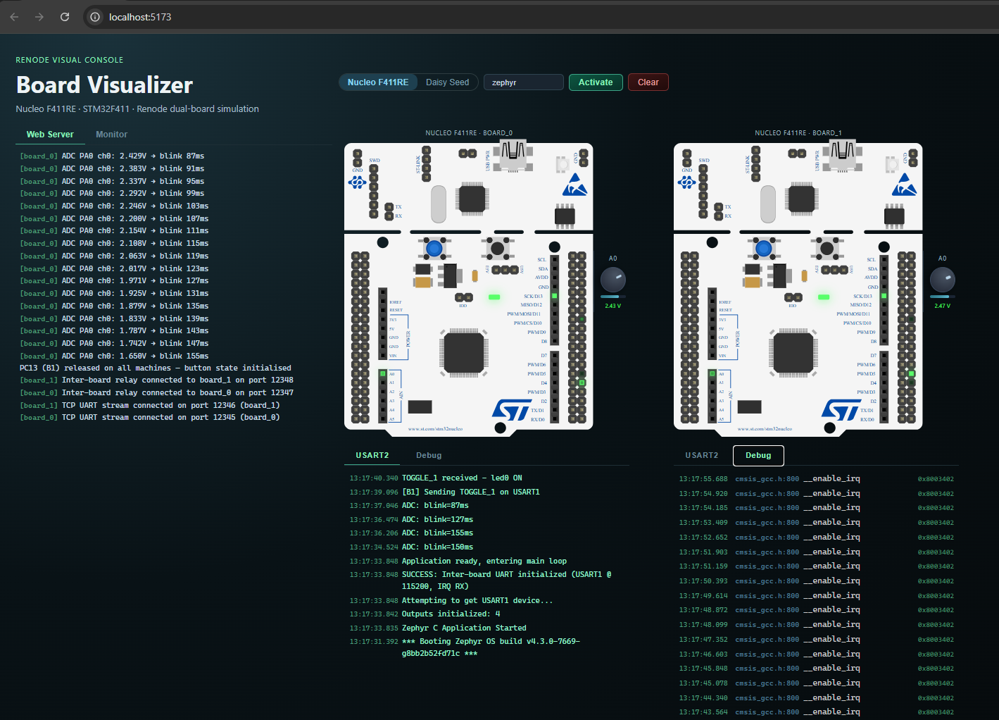
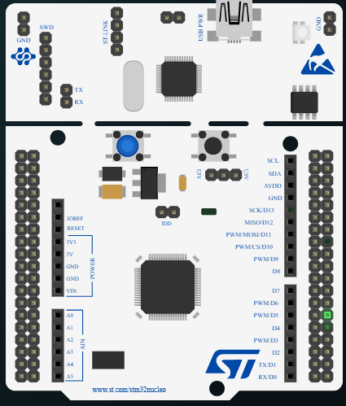
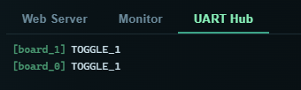
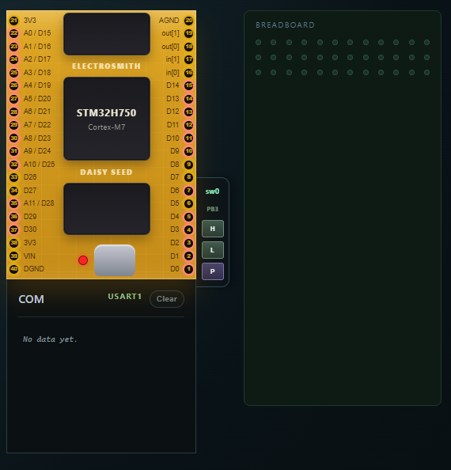
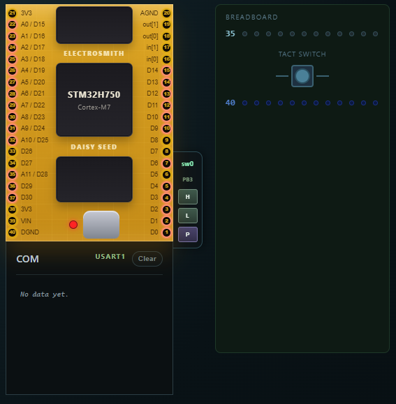
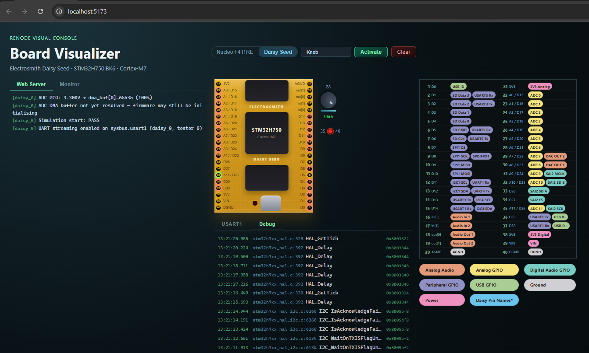
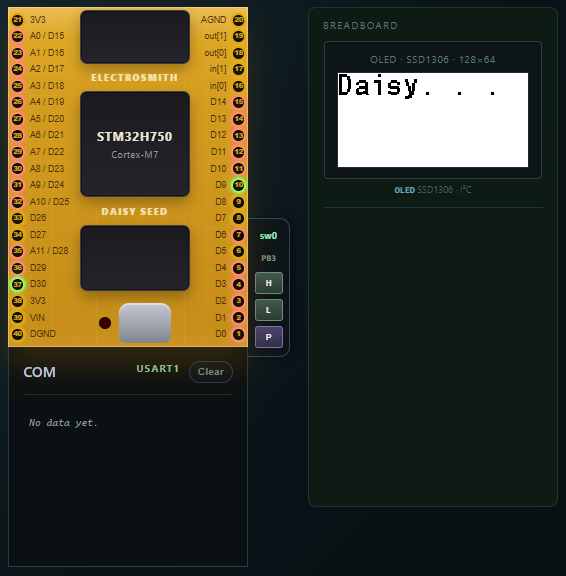

# Renode Visual Console

> **Repository:** https://github.com/magnusarinell/renode-visual-console

## Introduction

**Renode Visual Console** is a browser-based simulation frontend for embedded firmware development. It bridges the gap between writing firmware and seeing it behave — no hardware, no oscilloscope, no lab bench required.

The idea is simple: run your firmware inside Renode, and get a live visual console in the browser where you can observe LED states, inject GPIO signals, dial in ADC voltages, trigger interrupts between boards, and stream UART logs in real time. Everything you'd poke at with probes and buttons on a real board is available as a clean web UI.

Two simulation scenarios are included out of the box:

**STM32F411RE Nucleo (dual-board)** — Two `nucleo_f411re` boards running simultaneously, connected via separate UART terminals for inter-board communication. Firmware is written in **C on Zephyr RTOS** and features LED animation modes, button input, and cross-board interrupt signalling.

**Electrosmith Daisy Seed** — Real, unmodified **libDaisy** example applications running inside Renode on a simulated **STM32H750IBK6** (Cortex-M7). Switch between firmwares (Blink, Button, Knob, OLED) without recompiling: the breadboard panel adapts to show exactly the components each firmware uses — a potentiometer and LED for Knob, a tact switch for Button, an SSD1306 OLED display for OLED, and an empty board for Blink. Python peripheral stubs provide the hardware-init responses that Renode's built-in models omit for the H7 family (RCC, PWR, FLASH, ADC, SPI), so the same ELFs that run on real hardware boot and execute correctly in simulation.

The architecture is board-agnostic. Renode supports hundreds of platforms; adapting it to a different microcontroller or adding more virtual boards is a matter of swapping the Renode machine description.

Use cases include:
- **Richer development observability** — see LED states, GPIO levels, and UART output all at once in a live dashboard instead of squinting at a debugger or wiring up an LA
- **Frictionless input injection** — press virtual buttons, set ADC voltages, and toggle GPIO pins from a slider or click rather than reaching for jumper wires or a function generator
- **Multi-board scenarios without the hardware** — stand up two (or more) communicating boards instantly, useful when you're waiting for PCBs or working remotely
- **Running real SDK examples** — boot actual libDaisy apps in simulation and watch them interact with virtual peripherals in real time
- **Demo and education** — walk someone through embedded firmware behaviour interactively in a browser; no toolchain, no hardware, no setup on the viewer's side

---

## Screenshots

### STM32F411RE Nucleo — Dashboard Overview


### STM32F411RE Nucleo — Board Card with LEDs and Pin Headers


### STM32F411RE Nucleo — UART Log (Live Output from Both Boards)


---

### Daisy Seed — Blink firmware (empty breadboard, onboard LED)

<!-- TODO: screenshot placeholder — capture with Blink.elf loaded -->

### Daisy Seed — Button firmware (tact switch, pin 35 → GND)

<!-- TODO: screenshot placeholder — capture with Button.elf loaded, tact pressed -->

### Daisy Seed — Knob firmware (potentiometer + LED, ADC injection)

<!-- TODO: screenshot placeholder — capture with Knob.elf loaded, knob dialled up -->

### Daisy Seed — OLED firmware (SSD1306 display rendering)

<!-- TODO: screenshot placeholder — capture with OLED.elf loaded, display showing output -->

---

## Features

### STM32F411RE Nucleo (dual-board)
- **Dual-board simulation** – Two STM32F411RE Nucleo boards running simultaneously in Renode, each with separate UART terminals
- **LED animation modes** – Three firmware modes (BLINK, CHASE, SHOWCASE) controlled by button press
- **GPIO control** – Read and write any GPIO pin from the web UI; trigger interrupts between boards
- **Live UART logging** – Real-time log streaming from USART2 (debug console) and USART1 (inter-board) for both boards

### Electrosmith Daisy Seed
- **Real libDaisy apps** – Unmodified example ELFs from the official libDaisy/DaisyExamples repository boot and run in Renode
- **Hot firmware switching** – Select a different ELF from the dropdown and click Activate; no rebuild needed
- **Adaptive breadboard** – The virtual breadboard shows only the components relevant to the active firmware (pot, tact switch, OLED display, or empty)
- **ADC injection via DMA** – Drag the virtual potentiometer to set the ADC input voltage; value is written directly to the firmware's DMA buffer in real time
- **OLED rendering** – SPI traffic to the SSD1306 is intercepted and rendered as a live 128×64 display in the browser
- **Soft-PWM LED visualisation** – Rolling average of PA2 GPIO samples drives a virtual LED brightness indicator

### General
- **No hardware required** – Entire stack runs inside Renode; firmware is identical to what runs on real hardware
- **No admin rights needed** – Portable Renode, user-level Python, Git Bash

---

## How to Use the Console

### 1. Start the stack

```bash
npm start
```

Open **http://localhost:5173** in your browser.

### 2. Choose a board scenario

Use the **Nucleo** / **Daisy Seed** toggle in the top bar to switch between scenarios. The board view and available firmware list update accordingly.

### 3. Select firmware

If multiple ELF files are available a dropdown appears. For Daisy Seed, the available firmwares are:

| Firmware | What it does | Breadboard |
|----------|-------------|------------|
| **Blink** | Toggles the onboard PC7 LED | Empty board |
| **Button** | Reads a tact switch on pin 35 (PA2, pull-up) | Tact switch → GND (pin 40) |
| **Knob** | Reads ADC wiper on pin 28 (PC4) and drives soft-PWM on pin 35 (PA2) | Potentiometer + LED |
| **OLED** | Renders a demo on an SSD1306 OLED via SPI | OLED display |

For Nucleo, pick any built ELF from the `zephyr/build/` output.

### 4. Activate

Click **Activate** to load the selected firmware into Renode and start the simulation. The status pill changes to **Running**.

### 5. Interact

- **Daisy / Blink** — Watch the onboard LED indicator on the board header
- **Daisy / Button** — Click and hold the tact switch on the breadboard; release to trigger the button-release event
- **Daisy / Knob** — Drag the potentiometer knob up/down to set the ADC voltage (0–3.3 V); the LED dims and brightens in response to the soft-PWM output
- **Daisy / OLED** — The SSD1306 display renders live output from the firmware in the breadboard panel
- **Nucleo** — Use the GPIO inject buttons on each board card to set pin levels

### 6. Switch firmware

Select a different ELF in the dropdown and click **Activate** again. The simulation reloads with the new firmware and the breadboard adapts automatically. No restart needed.

### 7. Clear

Click **Clear** to stop the simulation and reset all state (logs, pin levels, OLED frame).

---

## Architecture

### STM32F411RE Nucleo (dual-board)

```
┌───────────────────────────────────────────────────────────────┐
│                        Renode Headless                        │
│                                                               │
│  ┌────────────────────┐               ┌────────────────────┐  │
│  │  STM32F411RE Nucleo│               │ STM32F411RE Nucleo │  │
│  │       board_0      │               │    board_1         │  │
│  │  PA5:  LD2 LED     │               │  PA5:  LD2 LED     │  │
│  │  PC13: B1 Button   │               │  PC13: B1 Button   │  │
│  │  PB12-14: LEDs     │               │  PB12-14: LEDs     │  │
│  └────────────────────┘               └────────────────────┘  │
│    │ USART2 (debug)                    │ USART2 (debug)       │
│    │ USART1 (inter-board)              │ USART1 (inter-board) │
│                         Robot server                          │
│                        (XML-RPC :55555)                       │
└───────────────────────────────────────────────────────────────┘
                                  │
                            Node.js backend
                            (WebSocket :8787)
                                  │
                            React frontend
                            (Vite dev :5173)
```

### Electrosmith Daisy Seed

```
┌───────────────────────────────────────────────────────────────┐
│                        Renode Headless                        │
│                                                               │
│  ┌──────────────────────────────────────────────────────────┐ │
│  │              STM32H750IBK6  (daisy_0)                    │ │
│  │                                                          │ │
│  │  PC7:  onboard LED (Blink)                               │ │
│  │  PA2:  breadboard LED / button input (Knob / Button)     │ │
│  │  PC4:  ADC wiper via DMA — Knob firmware                 │ │
│  │  SPI1: SSD1306 OLED data — OLED firmware                 │ │
│  │  USART6: debug UART log output                           │ │
│  │                                                          │ │
│  │  Python peripheral stubs                                 │ │
│  │    stm32h7_rcc_stub    — clock/PLL ready flags           │ │
│  │    stm32h7_pwr_stub    — power domain ready flags        │ │
│  │    stm32h7_flash_stub  — flash ACR / wait-states         │ │
│  │    stm32h7_adc_stub    — H7 ADC register layout + DMA    │ │
│  │    ssd1306_spi_stub    — captures SPI frames → bin file  │ │
│  └──────────────────────────────────────────────────────────┘ │
│                         Robot server                          │
│                        (XML-RPC :55555)                       │
└───────────────────────────────────────────────────────────────┘
                                  │
                     Node.js backend (WebSocket :8787)
                       • GPIO polling / injection
                       • ADC DMA buffer write
                       • OLED frame relay (base64)
                                  │
                     React frontend (Vite dev :5173)
                       • DaisySeedBoard + BreadboardPanel
                         (adapts to firmware: Blink/Button/Knob/OLED)
```

---

## Prerequisites

| Tool | Notes |
|------|-------|
| [Zephyr SDK 0.17.x](https://docs.zephyrproject.org/latest/develop/toolchains/zephyr_sdk.html) | Extract to any user-writable folder (e.g. `~/zephyr-sdk`) |
| [west](https://docs.zephyrproject.org/latest/develop/west/index.html) | `pip install --user west` |
| [Renode portable](https://github.com/renode/renode/releases) | Extract zip; add to `PATH` |
| [Node.js ≥ 18](https://nodejs.org/) | LTS recommended |
| [Git Bash](https://gitforwindows.org/) | Required on Windows for build scripts |
| [CMake ≥ 3.20](https://cmake.org/) | Add to `PATH` |

---

## Quick Start

```bash
# 1. Clone and initialise the Zephyr workspace (for the Nucleo firmware)
git clone https://github.com/magnusarinell/renode-visual-console.git
cd renode-visual-console/zephyr
# If ZEPHYR_BASE is set in your environment, unset it first:
unset ZEPHYR_BASE
west init -l app
west update
west zephyr-export

# 2. Set up the libDaisy toolchain and fetch the Daisy example sources
cd ..
npm run setup:daisy

# 3. Install JavaScript dependencies
npm run deps

# 4. Build all firmware
#    Builds: STM32F411RE Nucleo (Zephyr) + Daisy Seed Blink, OLED, Button, Knob
npm run build

# 5. Start everything (Renode + backend + frontend)
npm start
# → Renode robot server on :55555
# → WebSocket backend on :8787
# → Vite frontend on http://localhost:5173
```

Open **http://localhost:5173** in your browser.

---

## Build Commands

| Command | Description |
|---------|-------------|
| `npm run build` | Build all firmware: STM32F411RE Nucleo + Daisy Seed Blink, OLED, Button, Knob |
| `npm run build:daisy:blink` | Build only Daisy Seed Blink |
| `npm run build:daisy:button` | Build only Daisy Seed Button |
| `npm run build:daisy:knob` | Build only Daisy Seed Knob |
| `npm run build:daisy:oled` | Build only Daisy Seed OLED |
| `npm run setup:daisy` | Fetch and set up libDaisy + DaisyExamples sources |
| `npm run deps` | Install all JS dependencies (root + backend + frontend) |
| `npm start` | Start Renode + backend + frontend concurrently |
| `npm run start:verbose` | Same but with Renode monitor visible |

---

## Firmware Overview

### STM32F411RE Nucleo — Zephyr RTOS

The firmware targets the **STM32F411RE Nucleo** (`nucleo_f411re` in Zephyr) and runs in Renode using the `nucleo_f411re.repl` platform description.

#### LED Animation Modes

Press the user button (PA0) to cycle through modes:

| Mode | Behaviour |
|------|-----------|
| **BLINK** | All 4 LEDs toggle simultaneously; speed set by ADC |
| **CHASE** | Single LED steps through PD12→PD13→PD14→PD15 |
| **SHOWCASE** | Symmetric wave pattern across all 4 LEDs |

Three mode-indicator LEDs (PB12–PB14) show the active mode.

#### Inter-board Communication

Both boards have independent UART1 terminals for inter-board communication. USART2 is the debug console exposed via Renode's analyzer.

---

### Electrosmith Daisy Seed — libDaisy examples

These are real, unmodified C++ applications from the [libDaisy](https://github.com/electro-smith/libDaisy) / [DaisyExamples](https://github.com/electro-smith/DaisyExamples) repositories. They are compiled for the actual Daisy Seed hardware (`STM32H750IBK6`, Cortex-M7) with no simulation-specific changes. Renode runs the identical ELF that would flash to a real board.

The key challenge is that libDaisy's `System::Init()` aggressively configures clocks, power regulators, and flash wait-states, then busy-waits on ready flags that Renode's built-in peripheral models never set. A set of **Python peripheral stubs** intercepts those register spaces and returns the expected ready bits, allowing the firmware to boot past hardware init and reach `main()`.

| Example | STM32 pins | What it does |
|---------|-----------|-------------|
| **Blink** | PC7 (onboard LED) | Toggles the onboard LED at 500 ms intervals |
| **Button** | PA2 (input, pull-up), PC7 (LED) | Onboard LED follows tact-switch state on pin 35 |
| **Knob** | PC4 (ADC wiper, pin 28), PA2 (soft-PWM output, pin 35) | Reads pot voltage via ADC+DMA, drives LED brightness |
| **OLED** | SPI1 → SSD1306 | Renders text/graphics on a 128×64 OLED display |

#### Peripheral stubs

| Stub | Peripheral | Why needed |
|------|-----------|-----------|
| `stm32h7_rcc_stub.py` | RCC, PWR, FLASH | Returns PLL/VOS/flash-ready flags so `System::Init()` proceeds |
| `stm32h7_syscfg_stub.py` | SYSCFG | Returns analog-switch boost bits queried by HAL |
| `stm32h7_qspi_stub.py` | QSPI | Stubs QSPI busy bit so `QSPIHandle::Init()` returns |
| `stm32h7_adc_stub.py` | ADC1/ADC2 | H7 ADC register layout (PCSEL/SQR); clears ADCAL so `HAL_ADCEx_Calibration_Start()` returns |
| `ssd1306_spi_stub.py` | SPI1 | Intercepts SSD1306 page writes; writes complete framebuffer to a temp file for the backend to relay to the browser |

#### ADC injection (Knob firmware)

The Knob example uses DMA to transfer ADC samples to a buffer in D2 SRAM. The backend reads the DMA1 Stream2 M0AR register (`0x4002004C`) after firmware init to find the buffer address dynamically, then writes 16-bit samples directly with `sysbus WriteWord`. Moving the on-screen knob triggers a WebSocket message that the backend converts to the matching ADC raw value.

---

## Backend Configuration

Environment variables for `backend/index.mjs`:

| Variable | Default | Description |
|----------|---------|-------------|
| `RENODE_BRIDGE_PORT` | `8787` | WebSocket server port |
| `RENODE_MODE` | auto | `robot` \| `external` \| `spawn` |
| `RENODE_ROBOT_PORT` | `55555` | Renode robot server port |
| `RENODE_ROBOT_HOST` | `localhost` | Renode robot server host |
| `RENODE_MACHINES` | `board_0,board_1` | Comma-separated machine names |
| `RENODE_SCRIPT` | `renode/nucleo/nucleo_dual.resc` | Renode script path |
| `AUTO_START_RENODE` | `true` | Start simulation on backend launch |

---

## Project Structure

```
├── zephyr/
│   ├── app/                    # Zephyr application (C firmware, STM32F411RE Nucleo)
│   │   └── src/                # main.c, gpio_irq.c, uart_comm.c, outputs.c
├── renode/
│   └── daisy/
│       ├── daisy_seed.resc     # Daisy Seed Renode script (loads ELF, stubs, starts CPU)
│       ├── daisy_seed.repl     # Daisy Seed platform description (STM32H750 + external memory)
│       ├── daisy_stubs.repl    # Python peripheral registrations
│       ├── stm32h7_rcc_stub.py # RCC / PWR / FLASH ready-flag stub
│       ├── stm32h7_adc_stub.py # H7 ADC1/ADC2 register stub (ADCAL + DMA injection)
│       ├── stm32h7_syscfg_stub.py
│       ├── stm32h7_qspi_stub.py
│       └── ssd1306_spi_stub.py # SPI1 → SSD1306 framebuffer capture
├── libdaisy-examples/          # electro-smith/libDaisy + DaisyExamples (git submodules)
│   └── seed/
│       ├── Blink/build/Blink.elf
│       ├── Button/build/Button.elf
│       ├── Knob/build/Knob.elf
│       └── OLED/build/OLED.elf
├── backend/
│   └── index.mjs               # Node.js WebSocket ↔ Renode XML-RPC bridge
├── frontend/
│   └── src/
│       ├── App.jsx             # Top-level: board toggle, ELF selector, scenario routing
│       └── components/
│           ├── BoardCard.jsx   # STM32F411RE Nucleo board UI
│           └── daisy/
│               ├── DaisySeedBoard.jsx   # Daisy board layout + pin header
│               ├── BreadboardPanel.jsx  # Adaptive breadboard (blink/button/knob/oled)
│               └── OledDisplay.jsx      # SSD1306 128×64 canvas renderer
├── scripts/                    # Build and run scripts (invoked via dev.sh)
├── docs/screenshots/           # Screenshots (referenced in this README)
└── dev.sh                      # Unified CLI entry point
```

---

## License

MIT
