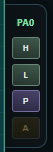
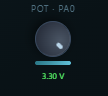

# Renode Visual Console

> **Repository:** https://github.com/magnusarinell/renode-visual-console

## Introduction

**Renode Visual Console** is a browser-based simulation frontend for embedded firmware development. It bridges the gap between writing firmware and seeing it behave — no hardware, no oscilloscope, no lab bench required.

The idea is simple: run your firmware inside Renode, and get a live visual console in the browser where you can observe LED states, inject GPIO signals, dial in ADC voltages, trigger interrupts between boards, and stream UART logs in real time. Everything you'd poke at with probes and buttons on a real board is available as a clean web UI.

The included reference implementation targets two **STM32F4 Discovery** boards running simultaneously, connected via a UART Hub for inter-board communication — but the architecture is board-agnostic. Renode supports hundreds of platforms; the firmware is written in **C** on **Zephyr RTOS**, and the backend speaks standard XML-RPC to Renode's robot server. Adapting it to a different microcontroller or adding more virtual boards is a matter of swapping the Renode machine description and the Zephyr board target.

Use cases include:
- **Richer development observability** — see LED states, GPIO levels, and UART output all at once in a live dashboard instead of squinting at a debugger or wiring up an LA
- **Frictionless input injection** — press virtual buttons, set ADC voltages, and toggle GPIO pins from a slider or click rather than reaching for jumper wires or a function generator
- **Multi-board scenarios without the hardware** — stand up two (or more) communicating boards instantly, useful when you're waiting for PCBs or working remotely
- **Demo and education** — walk someone through embedded firmware behaviour interactively in a browser; no toolchain, no hardware, no setup on the viewer's side

---

## Screenshots

### Dashboard – Dual Board Overview


### Board Card – LEDs and Pin Headers


### Pin Control – Inject GPIO Signals


### Analog Slider – ADC Voltage Injection


### UART Log – Live Output from Both Boards


---

## Features

- **Dual-board simulation** – Two STM32F4 Discovery boards running simultaneously in Renode, connected via a shared UART Hub for inter-board communication
- **LED animation modes** – Three firmware modes (BLINK, CHASE, SHOWCASE) controlled by button press; speed adjustable via ADC voltage
- **GPIO control** – Read and write any GPIO pin from the web UI; trigger interrupts between boards
- **Analog injection** – Set ADC input voltage (0–3.3 V) with a slider to dynamically alter LED animation speed
- **Live UART logging** – Real-time log streaming from USART3 (debug console) and USART2 (inter-board hub) for both boards
- **No hardware required** – Entire stack runs inside Renode; identical firmware runs on real hardware too
- **No admin rights needed** – Portable Renode, user-level Python, Git Bash

---

## Architecture

```
┌───────────────────────────────────────────────────────────────┐
│                        Renode Headless                        │
│                                                               │
│  ┌────────────────────┐    UART Hub   ┌────────────────────┐  │
│  │    STM32F4 Disco   │◄─────────────►│  STM32F4 Disco     │  │
│  │       board_0      │  (USART2)     │    board_1         │  │
│  │                    │               │                    │  │
│  │  PD12-15: LEDs     │               │  PD12-15: LEDs     │  │
│  │  PA0:     Button   │               │  PA0:     Button   │  │
│  │  PB5:     GPIO IRQ │               │  PB5:     GPIO IRQ │  │
│  │  PA1/PA6: ADC      │               │  PA1/PA6: ADC      │  │
│  └────────────────────┘               └────────────────────┘  │
│    │ USART3 (debug)                    │ USART3 (debug)       │ 
│                         Robot server                          │
│                        (XML-RPC :55555)                       │
└───────────────────────────────────────────────────────────────┘
                                  │
                            Node.js backend
                            (WebSocket :8787)
                                  │
                            React frontend
                            (Vite dev :5173)
```

---

## Prerequisites

| Tool | Notes |
|------|-------|
| [Zephyr SDK 0.17.x](https://docs.zephyrproject.org/latest/develop/toolchains/zephyr_sdk.html) | Extract to any user-writable folder (e.g. `~/zephyr-sdk`) |
| [west](https://docs.zephyrproject.org/latest/develop/west/index.html) | `pip install --user west` |
| [Renode portable](https://github.com/renode/renode/releases) | Extract zip; add to `PATH` |
| [Node.js ≥ 18](https://nodejs.org/) | LTS recommended |
| [Git Bash](https://gitforwindows.org/) | Required on Windows for build scripts |
| [CMake ≥ 3.20](https://cmake.org/) | Add to `PATH` |

---

## Quick Start

```bash
# 1. Clone and initialise the Zephyr workspace
git clone https://github.com/magnusarinell/renode-visual-console.git
cd renode-visual-console/zephyr
# If ZEPHYR_BASE is set in your environment, unset it first:
unset ZEPHYR_BASE
west init -l app
west update
west zephyr-export

# 2. Install JavaScript dependencies  (run from repo root)
cd ..
npm run deps

# 3. Build firmware (STM32F4 Discovery target)
npm run build

# 4. Start everything (Renode + backend + frontend)
npm start
# → Renode robot server on :55555
# → WebSocket backend on :8787
# → Vite frontend on http://localhost:5173
```

Open **http://localhost:5173** in your browser.

---

## Build Commands

| Command | Description |
|---------|-------------|
| `npm run build` | Build firmware for STM32F4 Discovery (Renode target) |
| `npm start` | Start Renode + backend + frontend concurrently |
| `bash dev.sh build-disco` | Build firmware (same as `npm run build`) |
| `bash dev.sh renode` | Build + launch Renode standalone (without web UI) |
| `bash dev.sh clean` | Remove `zephyr/build/` |
| `bash dev.sh rebuild` | Clean then build |

---

## Firmware Overview

The firmware targets the **STM32F4 Discovery Kit** (`stm32f4_disco` in Zephyr) and runs in Renode using the `stm32f4_discovery-kit` platform description.

### LED Animation Modes

Press the user button (PA0) to cycle through modes:

| Mode | Behaviour |
|------|-----------|
| **BLINK** | All 4 LEDs toggle simultaneously; speed set by ADC |
| **CHASE** | Single LED steps through PD12→PD13→PD14→PD15 |
| **SHOWCASE** | Symmetric wave pattern across all 4 LEDs |

Three mode-indicator LEDs (PB12–PB14) show the active mode.

### Inter-board Communication

Both boards share a **UART Hub** on USART2. When board_0's GPIO interrupt input (PB5) fires, it sends a `TOGGLE_1` command to board_1 via the hub, toggling board_1's LED (PD12).

---

## Backend Configuration

Environment variables for `backend/index.mjs`:

| Variable | Default | Description |
|----------|---------|-------------|
| `RENODE_BRIDGE_PORT` | `8787` | WebSocket server port |
| `RENODE_MODE` | auto | `robot` \| `external` \| `spawn` |
| `RENODE_ROBOT_PORT` | `55555` | Renode robot server port |
| `RENODE_ROBOT_HOST` | `localhost` | Renode robot server host |
| `RENODE_MACHINES` | `board_0,board_1` | Comma-separated machine names |
| `RENODE_SCRIPT` | `zephyr/renode/discovery_dual.resc` | Renode script path |
| `AUTO_START_RENODE` | `true` | Start simulation on backend launch |

---

## Project Structure

```
├── zephyr/
│   ├── app/            # Zephyr application (C firmware)
│   │   └── src/        # main.c, adc.c, gpio_irq.c, uart_comm.c, outputs.c
│   └── renode/
│       └── discovery_dual.resc  # Dual-board Renode script
├── backend/
│   └── index.mjs       # Node.js WebSocket ↔ Renode XML-RPC bridge
├── frontend/
│   └── src/            # React app (BoardCard, LogPanel, useWebSocket)
├── scripts/            # Build and run scripts (invoked via dev.sh)
└── dev.sh              # Unified CLI entry point
```

---

## License

MIT
